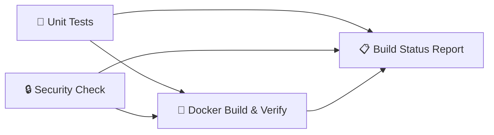

# Question 2 — Docker + GitHub Actions CI

## Complete Implementation Document

---

## 📝 Task Requirements


---

## ✅ Requirement Checklist

| # | Requirement | Status | How We Did It |
|---|---|---|---|
| 1 | Create a Git repository and add application files | ✅ Done | Fresh `git init` → pushed to GitHub (`Adityuh1/infodeskTask2`) |
| 2 | Create a Dockerfile and build the application as a Docker image | ✅ Done | `Dockerfile` with `node:20-slim`, non-root user, healthcheck |
| 3 | Run and verify the Docker container locally | ✅ Done | `docker-compose up --build` → verified via `curl /api/health` |
| 4 | GitHub Actions workflow that auto-runs on push | ✅ Done | `.github/workflows/ci.yml` triggers on `push` and `pull_request` to `main` |
| 5 | Workflow builds Docker image + performs validation/test | ✅ Done | 4-job pipeline: Unit Tests → Security Scan → Docker Build & Smoke Test |
| 6 | Workflow reports success or failure | ✅ Done | Final `📋 Build Status Report` job with `if: always()` |
| 7 | Document steps to run locally | ✅ Done | `README.md` with full setup instructions |

---

## 🏗️ Architecture Overview

```
💻 Your Machine (Host)
       │
       │  docker-compose up --build
       │
       ▼
┌──────────────────────────────────────────────┐
│  🐳 Docker Container: tech-debt-auditor-api  │
│                                              │
│  Base Image: node:20-slim                    │
│  User: node (non-root, uid=1000)             │
│  Port: 3001                                  │
│  Healthcheck: curl /api/health every 30s     │
│                                              │
│  ┌──────────────────────────────────────┐    │
│  │  Node.js Express Server (server.js)  │    │
│  │                                      │    │
│  │  GET  /              → API status    │    │
│  │  GET  /api/health    → Health check  │    │
│  │  POST /api/audit     → Scan a repo   │    │
│  └──────────────────────────────────────┘    │
│                                              │
│  ┌──────────────────────────────────────┐    │
│  │  Scanner Engine (scanner/)           │    │
│  │  ├── crawler.js    (file discovery)  │    │
│  │  ├── adapters/     (git blame)       │    │
│  │  └── scorer/       (Gemini AI)       │    │
│  └──────────────────────────────────────┘    │
└──────────────────────────────────────────────┘
       │
       │  Port mapping 3001:3001
       ▼
  http://localhost:3001
```

---

## 📁 Project Structure

```
infodeskTask2/
├── .dockerignore            ← Files excluded from Docker image
├── .env                     ← Secrets (gitignored, never committed)
├── .env.example             ← Safe template for environment variables
├── .github/
│   └── workflows/
│       └── ci.yml           ← GitHub Actions CI pipeline (4 jobs)
├── .gitignore
├── Dockerfile               ← Docker image blueprint
├── docker-compose.yml       ← Single-command local setup
├── README.md                ← Setup documentation
├── package.json
├── package-lock.json
├── server.js                ← Express API entry point
├── scanner/                 ← Core scanning engine
│   ├── index.js             ← Audit orchestrator
│   ├── crawler.js           ← Recursive file crawler
│   ├── adapters/
│   │   └── git-adapter.js   ← Git blame integration
│   └── scorer/
│       ├── router.js        ← AI vs local scoring router
│       ├── gemini-client.js ← Google Gemini API client
│       └── local-engine.js  ← Offline fallback scorer
├── tests/
│   ├── test-crawler.js
│   ├── test-git-adapter.js
│   └── test-scorer.js
└── dashboard/               ← React frontend (separate app)
```

---

## 📄 Files Created / Modified

### 1. `Dockerfile`

> **Purpose:** Blueprint that tells Docker how to build the application into a container image.

```dockerfile
FROM node:20-slim

LABEL maintainer="Tech-Debt Auditor"
LABEL description="Automated Tech-Debt Auditor — Express API Backend"
LABEL version="1.0.0"

WORKDIR /app

# Install git (for repo cloning) and curl (for healthcheck)
RUN apt-get update && \
    apt-get install -y --no-install-recommends git curl && \
    rm -rf /var/lib/apt/lists/*

# Layer-cache optimisation: copy package files first
COPY package.json package-lock.json ./
RUN npm ci --omit=dev

# Copy application source
COPY server.js ./
COPY scanner/ ./scanner/

# Prepare runtime directory with correct ownership
RUN mkdir -p temp-audits && chown -R node:node /app

# Security: run as non-root user
USER node

EXPOSE 3001

# Docker monitors /api/health every 30s
HEALTHCHECK --interval=30s --timeout=10s --start-period=15s --retries=3 \
    CMD curl -f http://localhost:3001/api/health || exit 1

CMD ["node", "server.js"]
```

**Key Design Decisions:**

| Decision | Why |
|---|---|
| `node:20-slim` | Official image, ~80MB — lean but complete |
| `npm ci --omit=dev` | Only installs production dependencies → smaller image |
| `COPY package*.json` first | Layer caching — dependencies only reinstall when package files change |
| `USER node` | Principle of least privilege — never run as root |
| `HEALTHCHECK` | Docker natively knows if the app is alive, not just "running" |

---

### 2. `.dockerignore`

> **Purpose:** Prevents unnecessary/sensitive files from being copied into the Docker image.

```
node_modules/
dashboard/node_modules/
.env
.env.*
!.env.example
.git/
.gitignore
dashboard/
dist/
build/
out/
*.log
temp-audits/
.vscode/
.idea/
.DS_Store
Thumbs.db
.github/
```

---

### 3. `docker-compose.yml`

> **Purpose:** Single-command local setup (`docker-compose up --build`).

```yaml
version: "3.9"

services:
  api:
    build:
      context: .
      dockerfile: Dockerfile
    container_name: tech-debt-auditor-api
    ports:
      - "3001:3001"
    env_file:
      - .env
    restart: unless-stopped
    healthcheck:
      test: ["CMD", "curl", "-f", "http://localhost:3001/api/health"]
      interval: 30s
      timeout: 10s
      retries: 3
      start_period: 15s
```

---

### 4. `.env.example`

> **Purpose:** Safe public template so anyone cloning the repo knows what environment variables to set.

```bash
# Copy this file to .env and fill in your actual values.
#   cp .env.example .env

GEMINI_API_KEY=your_gemini_api_key_here
PORT=3001
```

---

### 5. `.github/workflows/ci.yml`

> **Purpose:** Multi-stage CI pipeline that runs automatically on every push to `main`.

```yaml
name: Continuous Integration

on:
  push:
    branches: [main]
  pull_request:
    branches: [main]

jobs:
  # ==========================================
  # JOB 1: Run Code Tests
  # ==========================================
  test-code:
    name: 🧪 Unit Tests
    runs-on: ubuntu-latest
    steps:
      - uses: actions/checkout@v4
      - run: npm ci
      - run: node tests/test-crawler.js
      - run: node tests/test-git-adapter.js

  # ==========================================
  # JOB 2: Security Scan
  # ==========================================
  security-scan:
    name: 🔒 Security Check
    runs-on: ubuntu-latest
    steps:
      - uses: actions/checkout@v4
      - run: npm ci
      - name: Run Vulnerability Scan
        run: npm audit --audit-level=high

  # ==========================================
  # JOB 3: Docker Build & Smoke Test
  # ==========================================
  docker-pipeline:
    name: 🐳 Docker Build & Verify
    needs: [test-code, security-scan]
    runs-on: ubuntu-latest
    steps:
      - uses: actions/checkout@v4
      - name: Build Docker Image
        run: docker build -t tech-debt-auditor:test .
      - name: Run Container
        run: docker run -d -p 3001:3001 --name api-container tech-debt-auditor:test
      - name: Wait for Server
        run: sleep 5
      - name: Verify Health Endpoint
        run: curl --fail http://localhost:3001/api/health

  # ==========================================
  # JOB 4: Final Status Report
  # ==========================================
  report-status:
    name: 📋 Build Status Report
    needs: [test-code, security-scan, docker-pipeline]
    if: always()
    runs-on: ubuntu-latest
    steps:
      - name: Check Results
        run: |
          echo "========================================="
          echo "       CI PIPELINE STATUS REPORT         "
          echo "========================================="
          echo ""
          echo "Unit Tests:       ${{ needs.test-code.result }}"
          echo "Security Check:   ${{ needs.security-scan.result }}"
          echo "Docker Pipeline:  ${{ needs.docker-pipeline.result }}"
          echo ""
          echo "========================================="

          if [ "${{ needs.test-code.result }}" = "success" ] && \
             [ "${{ needs.security-scan.result }}" = "success" ] && \
             [ "${{ needs.docker-pipeline.result }}" = "success" ]; then
            echo "ALL CHECKS PASSED — BUILD SUCCESSFUL"
          else
            echo "ONE OR MORE CHECKS FAILED — BUILD FAILED"
            exit 1
          fi
```

**Pipeline Flow:**



> Jobs 1 and 2 run **in parallel**. Job 3 only starts after both pass. Job 4 always runs and reports the final verdict.

---

## 🐳 How to Run Locally

### Prerequisites

| Tool | Check Command |
|------|---------------|
| Git | `git --version` |
| Docker Desktop | `docker --version` |
| Docker Compose | `docker-compose --version` |

### Steps

```bash
# 1. Clone the repository
git clone https://github.com/Adityuh1/infodeskTask2.git
cd infodeskTask2

# 2. Set up environment variables
cp .env.example .env
# Edit .env and add your real GEMINI_API_KEY

# 3. Build and run the container
docker-compose up --build

# 4. Verify (in a new terminal)
curl http://localhost:3001/api/health
# Expected: {"status":"healthy","timestamp":"..."}

# 5. Stop the container
docker-compose down
```

---

## 🔐 Security Measures

| Measure | Implementation |
|---|---|
| **Non-root container** | `USER node` in Dockerfile — process runs as uid=1000 |
| **No secrets in image** | `.env` is in `.dockerignore` — injected at runtime via `env_file` |
| **Dependency audit** | CI Job 2 runs `npm audit --audit-level=high` on every push |
| **Minimal base image** | `node:20-slim` — no unnecessary packages |
| **Layer cache security** | Package files copied before source — secrets never leak through layers |

---

## 📸 Screenshots to Include in Submission

> [!IMPORTANT]
> The task asks for screenshots of important steps. Make sure to capture:

1. **Docker build output** — terminal showing `docker-compose up --build` completing successfully
2. **Container running** — terminal showing `🚀 Auditor Server listening on http://localhost:3001`
3. **Health check verification** — `curl http://localhost:3001/api/health` returning healthy JSON
4. **GitHub Actions pipeline** — the Actions tab showing all 4 jobs passing with the visual graph
5. **GitHub repository** — the repo page showing all committed files
6. **`docker ps`** — showing the running container with HEALTHY status

---

## 🎯 Submission Checklist

| Item | Status |
|---|---|
| GitHub repository link | 🔗 `https://github.com/Adityuh1/infodeskTask2` |
| Git repo with application files | ✅ |
| Dockerfile that builds the app | ✅ |
| Docker container runs locally | ✅ |
| GitHub Actions workflow (auto-trigger on push) | ✅ |
| Workflow builds Docker image | ✅ |
| Workflow performs validation/test | ✅ |
| Workflow reports success/failure | ✅ |
| Local run documentation (README.md) | ✅ |
| Screenshots of important steps | 📸 Capture these |
| ZIP file with all files + workflow config | 📦 Package for submission |
