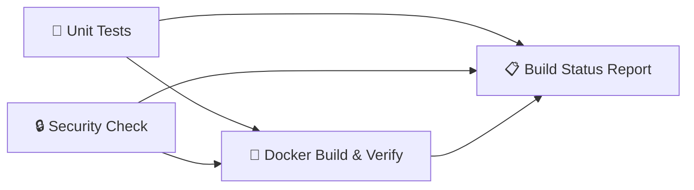

# Tech-Debt Auditor

A backend API that scans GitHub repositories for tech-debt markers (TODO, FIXME, HACK) and scores their severity using Google Gemini AI.

---

## Tech Stack

- **Runtime:** Node.js 20
- **Framework:** Express.js
- **AI Engine:** Google Gemini 1.5 Flash
- **Containerization:** Docker + Docker Compose
- **CI/CD:** GitHub Actions

---

## Project Structure

```
+-- Dockerfile
+-- docker-compose.yml
+-- .dockerignore
+-- .env.example
+-- .github/workflows/ci.yml
+-- server.js
+-- scanner/
�   +-- index.js
�   +-- crawler.js
�   +-- adapters/
�   +-- scorer/
+-- tests/
+-- dashboard/
```

---

## Running Locally

### Prerequisites

- [Git](https://git-scm.com/)
- [Docker Desktop](https://www.docker.com/products/docker-desktop/)

### Steps

**1. Clone the repository**

```bash
git clone https://github.com/Adityuh1/infodeskTask2.git
cd infodeskTask2
```

**2. Set up environment variables**

```bash
cp .env.example .env
```

Open `.env` and add your Gemini API key (get one free at [aistudio.google.com](https://aistudio.google.com/)):

```
GEMINI_API_KEY=your_actual_key_here
PORT=3001
```

### Step 3: Start the application

#### Option A: Run with Docker (Recommended)

```bash
docker-compose up --build
```

You should see:

```
?? Auditor Server listening on http://localhost:3001
```

To run in the background (detached mode):

```bash
docker-compose up -d --build
```

To stop:

```bash
docker-compose down
```

#### Option B: Run without Docker

```bash
# Install dependencies
npm install

# Start the server
npm start
```

**4. Verify the server is running**

Open a new terminal and run:

```bash
curl http://localhost:3001/api/health
```

Expected response:

```json
{ "status": "healthy", "timestamp": "2026-09-17T..." }
```

**5. Stop the container**

```bash
docker-compose down
```

---

## API Endpoints

| Method | Endpoint | Description |
|--------|----------|-------------|
| GET | `/` | Confirms API is running |
| GET | `/api/health` | Health check |
| POST | `/api/audit` | Scan a repo for tech-debt |

### Example: Scan a Repository

```bash
curl -X POST http://localhost:3001/api/audit \
  -H "Content-Type: application/json" \
  -d '{"repoUrl": "https://github.com/username/repo"}'
```

---

## CI/CD Pipeline

The GitHub Actions workflow (`.github/workflows/ci.yml`) runs automatically on every push to `main`:

**Pipeline Flow:**



> Jobs 1 and 2 run **in parallel**. Job 3 only starts after both pass. Job 4 always runs and reports the final verdict.

---

## Docker Details

- **Base image:** `node:20-slim`
- **Security:** Runs as non-root `node` user
- **Health monitoring:** Built-in `HEALTHCHECK` on `/api/health`
- **Secrets:** `.env` is never baked into the image � injected at runtime via `env_file`

---

## Environment Variables

| Variable | Required | Default | Description |
|----------|----------|---------|-------------|
| `GEMINI_API_KEY` | Yes | � | Google Gemini API key |
| `PORT` | No | `3001` | Server port |
